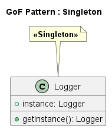
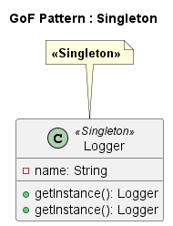
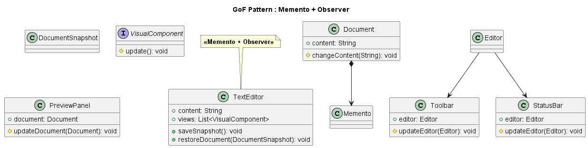
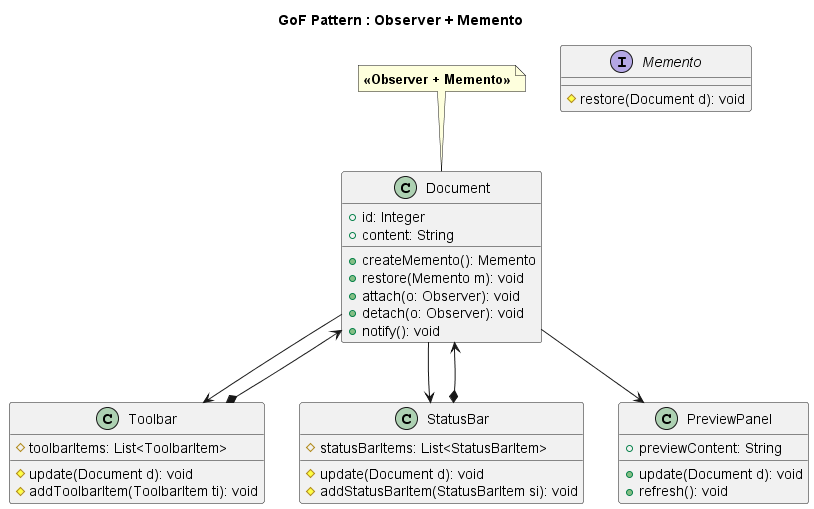
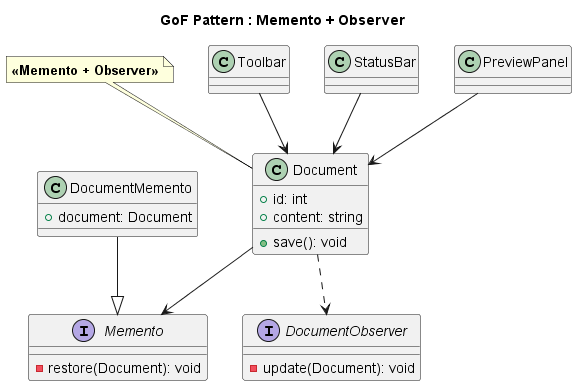
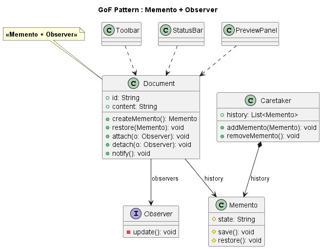
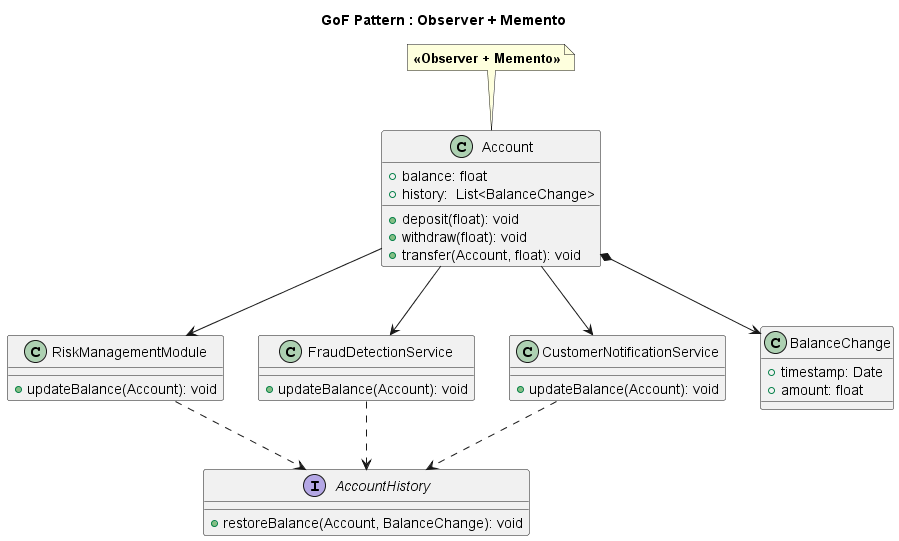
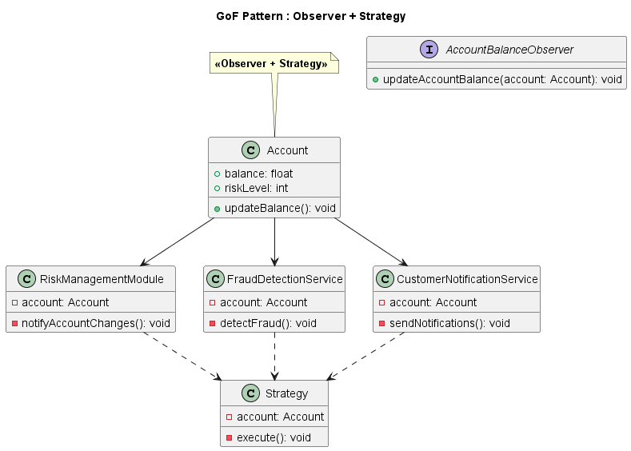

# gof1 — GoF Pattern Detector with Active Inference

Benchmark comparing two modes of GoF class diagram generation:
- **LLM_ONLY**: the LLM receives the raw prompt and generates JSON directly
- **LLM_AI**: an Active Inference agent detects the pattern and enriches the prompt before the LLM call

Hypothesis to validate: **(Φᵢ/E)_AI ≥ (Φᵢ/E)_LLM** and **Rᵍ > 0**.

---

## Theoretical Framework (CIITR)

Comprehension is defined as:

**Cᵢ = Φᵢ × Rᵍ**

| Symbol | Meaning |
|--------|---------|
| **Φᵢ** | Structural integration — coherence of the generated diagram |
| **Rᵍ** | Rhythmic grounding — recursive belief update |
| **CPJ** | Comprehension per Joule = Cᵢ / energy (epistemic efficiency) |

Link to Friston:
- **LLM alone → Rᵍ = 0**: frozen weights, no update during inference
- **Active Inference agent → Rᵍ > 0**: VFE minimisation, beliefs updated at each observation

---

## Project Architecture

```
gof1/
├── agent_ai/
│   └── gof_ai_agent.py     # Active Inference agent (matrices A 32×23, B 23×23)
├── agent_llm/
│   └── llm.py              # LLM calls — local (llama3.1:8b) or remote (devstral-small-2:24b)
├── gof/
│   ├── generator.py        # LLM prompt builder (with/without AI context)
│   ├── metamodel.py        # JSON validation + PlantUML translation
│   └── schema.py           # Canonical schemas for all 23 GoF patterns (min_classes, rel_types, key_methods)
├── metrics/
│   └── export.py           # CSV export
├── benchmark_gof.py        # Main pipeline
└── sessions_gof.yaml       # Test sessions (GOF-001 to GOF-007)
```

---

## Pipeline

```
objective
   │
   ├─── LLM_ONLY ──────────────────────────────────────────────────┐
   │     raw prompt → LLM → JSON → validate → PlantUML → CPJ       │
   │                                                                 │
   └─── LLM_AI ──────────────────────────────────────────────────── ┤
         keywords → AI agent → enriched context                     │
              → enriched prompt → LLM → JSON → validate → PlantUML → CPJ
                                                                     │
                                                              CSV export
```

---

## Active Inference Agent

Implemented in [agent_ai/gof_ai_agent.py](agent_ai/gof_ai_agent.py).

**Generative model matrices:**

| Matrix | Dimensions | Meaning |
|--------|-----------|---------|
| `_A` | 32 × 23 | P(keyword \| pattern) — likelihood, columns normalised to 1 |
| `_B` | 23 × 23 | P(next pattern \| current pattern) — stay=0.85 |
| `_posterior` | 23 | Q(s) — current belief over active pattern |
| `_prior` | 23 | P(s) — predictive prior for next observation |

**Bayesian update** at each `observe_keyword(kw)`:

```python
likelihood = _A[kw_idx, :]
unnorm     = likelihood * prior        # P(o|s) · P(s)
evidence   = unnorm.sum()              # P(o) — marginal
surprise   = -log(evidence)           # simplified VFE
posterior  = unnorm / evidence         # Bayes rule
prior      = _B @ posterior            # predictive prior t+1
```

**23 supported GoF patterns:** Singleton, FactoryMethod, AbstractFactory, Builder, Prototype, Adapter, Bridge, Composite, Decorator, Facade, Flyweight, Proxy, ChainOfResponsibility, Command, Interpreter, Iterator, Mediator, Memento, Observer, State, Strategy, TemplateMethod, Visitor

**32 recognised keywords:** unique, single, global, instance, factory, build, step, clone, copy, adapt, convert, incompatible, decorate, wrap, proxy, facade, simplify, tree, leaf, share, notify, subscribe, execute, undo, visit, iterate, chain, handler, template, skeleton, snapshot, grammar

---

## JSON Format Produced by the LLM

```json
{
  "pattern": "Singleton",
  "patterns": ["PatternA", "PatternB"],
  "classes": [
    {
      "id": "uniqueId",
      "name": "ClassName",
      "type": "class | abstract | interface",
      "attributes": ["- name: Type"],
      "methods": ["+ method(): ReturnType"]
    }
  ],
  "relationships": [
    {
      "type": "inheritance | implementation | association | dependency | composition | aggregation",
      "sourceId": "...",
      "targetId": "...",
      "label": "optional"
    }
  ]
}
```

Generated PlantUML arrows: `--|>` inheritance · `..|>` implementation · `-->` association · `..>` dependency · `*-->` composition · `o-->` aggregation

---

## Test Sessions

| Session | Target Pattern | Description |
|---------|---------------|-------------|
| GOF-001 | Singleton | Logger with single instance |
| GOF-002 | Adapter | Payment interface adapter |
| GOF-003 | Observer | Notification/subscription system |
| GOF-004 | Builder | Fluent SQL query builder |
| GOF-005 | Memento | Document snapshots for undo |
| GOF-006 | Memento | Same as GOF-005 (reference run) |
| GOF-007 | Memento + Observer | Text editor — implicit multi-pattern objective |
| GOF-008 | Composite | File system domain model (files, folders, links) |

---

## Exported Results (CSV)

| Column | Description |
|--------|-------------|
| Session | Session identifier |
| Mode | `LLM_ONLY` or `LLM_AI` |
| Iteration | Iteration number |
| Status | `WARMUP` · `ACCEPTED` · `REJECTED` |
| Energy_J | Energy consumed (joules, CPU_WATTS=28) |
| Comprehension | Φᵢ = n_classes + 2 × n_relationships — unbounded structural integration score |
| Phi_E | **Primary metric** — Φᵢ / Energy_J (structural quality per joule) |
| CPJ | Φᵢ × Rg / Energy_J — logged for reference only; always 0 in LLM_ONLY (Rg=0 by definition) |
| Rg | Mean surprise −log P(o) — 0 in LLM_ONLY, > 0 validates belief update in LLM_AI |
| Pattern | Pattern produced by the LLM (e.g. `Memento+Observer`) |
| Error | Error message if REJECTED |

---

## LLM

| Mode | Model | Endpoint | Energy constant |
|------|-------|----------|----------------|
| Local (Ollama) | `llama3.1:8b` | `ollama` CLI | `CPU_WATTS = 28 W` |
| **MLX — Apple M-series** | `mlx-community/Meta-Llama-3.1-8B-Instruct-4bit` | Neural Engine + GPU | `M3_WATTS = 12 W` |
| Remote | `devstral-small-2:24b` | `https://ollama.iboo.ovh/api/generate` | `CPU_WATTS = 28 W` |

---

## Installation

```bash
# Linux / Windows (Ollama)
pip install numpy pyyaml requests psutil
# Install ollama then: ollama pull llama3.1:8b

# Mac M-series (MLX — Neural Engine)
pip install -r requirements_mac.txt
# Model (~5 GB) is downloaded automatically from HuggingFace on first run
```

---

## Usage

```bash
# All sessions — Ollama local
python benchmark_gof.py

# Single session — Ollama local
python benchmark_gof.py --session GOF-001

# Single session — MLX on Apple Silicon (Mac M1/M2/M3)
python benchmark_gof.py --mlx --session GOF-001

# All sessions — MLX
python benchmark_gof.py --mlx

# Remote LLM
python benchmark_gof.py --session GOF-001 --remote

# LLM_ONLY mode (no AI agent)
python benchmark_gof.py --mlx --session GOF-001 --no-ai

# Custom number of iterations (default: 3)
python benchmark_gof.py --mlx --session GOF-001 --max-iters 5

# Number of warmup iterations to exclude from stats (default: 1)
python benchmark_gof.py --mlx --session GOF-001 --warmup-iters 2
```

| Argument | Default | Description |
|----------|---------|-------------|
| `--session` | all | `session_id` from `sessions_gof.yaml` |
| `--mlx` | — | Use MLX on Apple Silicon (Neural Engine + GPU) |
| `--remote` | local | Use remote LLM (`devstral-small-2:24b`) — overrides `--mlx` |
| `--no-ai` | — | Disable the Active Inference agent (LLM_ONLY only) |
| `--max-iters` | `3` | Total iterations per mode |
| `--warmup-iters` | `1` | Initial iterations excluded from statistics (tagged `WARMUP` in CSV) |

---

## Reference

Theoretical framework: **CIITR** — Tor-Ståle Hansen, Theoretical Note No. 2–2026.

---
---

# gof1 — GoF Pattern Detector with Active Inference (Français)

Benchmark comparant deux modes de génération de diagrammes de classes GoF :
- **LLM_ONLY** : le LLM reçoit le prompt brut et génère directement le JSON
- **LLM_AI** : un agent Active Inference détecte le pattern et enrichit le prompt avant l'appel LLM

L'hypothèse à démontrer : **(Φᵢ/E)_AI ≥ (Φᵢ/E)_LLM** et **Rᵍ > 0**.

---

## Cadre théorique (CIITR)

La compréhension est définie comme :

**Cᵢ = Φᵢ × Rᵍ**

| Symbole | Signification |
|---------|--------------|
| **Φᵢ** | Intégration structurelle — cohérence du diagramme généré |
| **Rᵍ** | Ancrage rythmique — mise à jour récursive des croyances |
| **CPJ** | Compréhension par Joule = Cᵢ / énergie (efficacité épistémique) |

Lien avec Friston :
- **LLM seul → Rᵍ = 0** : poids figés, aucune mise à jour pendant l'inférence
- **Agent Active Inference → Rᵍ > 0** : minimisation de la free energy (VFE), croyances mises à jour à chaque observation

---

## Architecture du projet

```
gof1/
├── agent_ai/
│   └── gof_ai_agent.py     # Agent Active Inference (matrices A 32×23, B 23×23)
├── agent_llm/
│   └── llm.py              # Appels LLM local (llama3.1:8b) ou remote (devstral-small-2:24b)
├── gof/
│   ├── generator.py        # Construction du prompt LLM (avec/sans contexte AI)
│   ├── metamodel.py        # Validation JSON + traduction PlantUML
│   └── schema.py           # Schémas canoniques des 23 patterns GoF (min_classes, rel_types, key_methods)
├── metrics/
│   └── export.py           # Export CSV des résultats
├── benchmark_gof.py        # Pipeline principal
└── sessions_gof.yaml       # Sessions de test (GOF-001 à GOF-007)
```

---

## Pipeline

```
objective
   │
   ├─── LLM_ONLY ──────────────────────────────────────────────────┐
   │     prompt brut → LLM → JSON → validate → PlantUML → CPJ      │
   │                                                                 │
   └─── LLM_AI ──────────────────────────────────────────────────── ┤
         keywords → agent AI → contexte enrichi                     │
              → prompt enrichi → LLM → JSON → validate → PlantUML → CPJ
                                                                     │
                                                              CSV export
```

---

## Agent Active Inference

Implémenté dans [agent_ai/gof_ai_agent.py](agent_ai/gof_ai_agent.py).

**Matrices du modèle génératif :**

| Matrice | Dimensions | Signification |
|---------|-----------|--------------|
| `_A` | 32 × 23 | P(keyword \| pattern) — vraisemblance, colonnes normalisées à 1 |
| `_B` | 23 × 23 | P(pattern suivant \| pattern courant) — stay=0.85 |
| `_posterior` | 23 | Q(s) — croyance courante sur le pattern actif |
| `_prior` | 23 | P(s) — prior prédictif pour la prochaine observation |

**Mise à jour bayésienne** à chaque `observe_keyword(kw)` :

```python
likelihood = _A[kw_idx, :]
unnorm     = likelihood * prior        # P(o|s) · P(s)
evidence   = unnorm.sum()              # P(o) — marginale
surprise   = -log(evidence)           # VFE simplifié
posterior  = unnorm / evidence         # Règle de Bayes
prior      = _B @ posterior            # Prior prédictif t+1
```

**23 patterns GoF supportés :** Singleton, FactoryMethod, AbstractFactory, Builder, Prototype, Adapter, Bridge, Composite, Decorator, Facade, Flyweight, Proxy, ChainOfResponsibility, Command, Interpreter, Iterator, Mediator, Memento, Observer, State, Strategy, TemplateMethod, Visitor

**32 mots-clés reconnus :** unique, single, global, instance, factory, build, step, clone, copy, adapt, convert, incompatible, decorate, wrap, proxy, facade, simplify, tree, leaf, share, notify, subscribe, execute, undo, visit, iterate, chain, handler, template, skeleton, snapshot, grammar

---

## Format JSON produit par le LLM

```json
{
  "pattern": "Singleton",
  "patterns": ["PatternA", "PatternB"],
  "classes": [
    {
      "id": "uniqueId",
      "name": "ClassName",
      "type": "class | abstract | interface",
      "attributes": ["- name: Type"],
      "methods": ["+ method(): ReturnType"]
    }
  ],
  "relationships": [
    {
      "type": "inheritance | implementation | association | dependency | composition | aggregation",
      "sourceId": "...",
      "targetId": "...",
      "label": "optional"
    }
  ]
}
```

Flèches PlantUML générées : `--|>` héritage · `..|>` implémentation · `-->` association · `..>` dépendance · `*-->` composition · `o-->` agrégation

---

## Sessions de test

| Session | Pattern cible | Description |
|---------|--------------|-------------|
| GOF-001 | Singleton | Logger avec instance unique |
| GOF-002 | Adapter | Adaptateur d'interface de paiement |
| GOF-003 | Observer | Système de notifications/abonnements |
| GOF-004 | Builder | Construction fluente de requêtes SQL |
| GOF-005 | Memento | Snapshots de document pour undo |
| GOF-006 | Memento | Idem GOF-005 (run de référence) |
| GOF-007 | Memento + Observer | Éditeur de texte — objectif implicite multi-pattern |
| GOF-008 | Composite | Modèle de domaine système de fichiers (fichiers, dossiers, liens) |

---

## Résultats exportés (CSV)

| Colonne | Description |
|---------|-------------|
| Session | Identifiant de la session |
| Mode | `LLM_ONLY` ou `LLM_AI` |
| Iteration | Numéro d'itération |
| Status | `WARMUP` · `ACCEPTED` · `REJECTED` |
| Energy_J | Énergie consommée (joules, CPU_WATTS=28) |
| Comprehension | Φᵢ = n_classes + 2 × n_relations — score d'intégration structurelle non borné |
| Phi_E | **Métrique principale** — Φᵢ / Energy_J (qualité structurelle par joule) |
| CPJ | Φᵢ × Rg / Energy_J — conservé à titre de référence ; toujours 0 en LLM_ONLY (Rg=0 par définition) |
| Rg | Moyenne de la surprise −log P(o) — 0 en LLM_ONLY, > 0 valide la mise à jour des croyances en LLM_AI |
| Pattern | Pattern produit par le LLM (ex. `Memento+Observer`) |
| Error | Message d'erreur si REJECTED |

---

## LLM

| Mode | Modèle | Endpoint | Constante énergie |
|------|--------|----------|------------------|
| Local (Ollama) | `llama3.1:8b` | `ollama` CLI | `CPU_WATTS = 28 W` |
| **MLX — Apple M-series** | `mlx-community/Meta-Llama-3.1-8B-Instruct-4bit` | Neural Engine + GPU | `M3_WATTS = 12 W` |
| Remote | `devstral-small-2:24b` | `https://ollama.iboo.ovh/api/generate` | `CPU_WATTS = 28 W` |

---

## Installation

```bash
# Linux / Windows (Ollama)
pip install numpy pyyaml requests psutil
# Installer ollama puis : ollama pull llama3.1:8b

# Mac M-series (MLX — Neural Engine)
pip install -r requirements_mac.txt
# Le modèle (~5 Go) est téléchargé automatiquement depuis HuggingFace au premier lancement
```

---

## Utilisation

```bash
# Toutes les sessions — Ollama local
python benchmark_gof.py

# Session spécifique — Ollama local
python benchmark_gof.py --session GOF-001

# Session spécifique — MLX sur Apple Silicon (Mac M1/M2/M3)
python benchmark_gof.py --mlx --session GOF-001

# Toutes les sessions — MLX
python benchmark_gof.py --mlx

# LLM remote
python benchmark_gof.py --session GOF-001 --remote

# Mode LLM_ONLY (sans agent AI)
python benchmark_gof.py --mlx --session GOF-001 --no-ai

# Nombre d'itérations personnalisé (défaut : 3)
python benchmark_gof.py --mlx --session GOF-001 --max-iters 5

# Nombre d'itérations de warmup à exclure des stats (défaut : 1)
python benchmark_gof.py --mlx --session GOF-001 --warmup-iters 2
```

| Argument | Défaut | Description |
|----------|--------|-------------|
| `--session` | toutes | `session_id` issu de `sessions_gof.yaml` |
| `--mlx` | — | Utilise MLX sur Apple Silicon (Neural Engine + GPU) |
| `--remote` | local | Utilise le LLM remote (`devstral-small-2:24b`) — écrase `--mlx` |
| `--no-ai` | — | Désactive l'agent Active Inference (LLM_ONLY uniquement) |
| `--max-iters` | `3` | Nombre total d'itérations par mode |
| `--warmup-iters` | `1` | Itérations initiales exclues des statistiques (tagged `WARMUP` dans le CSV) |

---

## Référence

Cadre théorique : **CIITR** — Tor-Ståle Hansen, Note théorique n°2–2026.


Examples :

--- Phi/E comparison ---
  LLM-only  Phi/E=26.6772/kJ  energy=935.879J  accepted=2
  LLM+AI    Phi/E=0.7215/kJ  energy=28611.195J  accepted=2
  Phi/E ratio (AI/LLM): 0.03x  ->  [WORSE]   -97.3%  — AI context degraded the solution
  Diagnosis: pattern 'Singleton' detected with confidence 1.00 but AI suggestion may have over-constrained the LLM output
  AI detected : Singleton  (confidence=1.00)  top3=['Singleton', 'AbstractFactory', 'FactoryMethod']
  Rg (mean VFE): 0.6846  |  Rg > 0: True  — belief update active
  PlantUML (AI): results\GOF-001_AI.puml
  PlantUML (LLM): results\GOF-001_LLM.puml

---

## Generated Diagrams — GOF-001

**LLM_AI (With Active Inference)**



**LLM_ONLY**



---

## C2TR — Theoretical Position Paper (English)

**Author:** Tor-Ståle Hansen | CIITR-METAINT | December 2025
**Title:** *The Future Is Not the Cloud – The Future Is Your Own Context, Running on Your Own Silicon*

### Central Thesis

Local, deterministic inference is the **only valid configuration** for governable AI comprehension. Cloud inference is classified as epistemically inadmissible because:
- `Rᵍ → 0` (no rhythmic coherence)
- CPJ is unmeasurable (opaque energy)
- Φᵢ is fragmented (untraceable symbolic integration)

### Key Concepts

| Concept | Definition |
|---------|-----------|
| **Cᵢ = Φᵢ × Rᵍ** | Comprehension = structural integration × rhythmic coherence |
| **CPJ** | Comprehension Per Joule = Cᵢ / E |
| **LISS** | Global instruction standard (epistemic OS) |
| **PSIS** | Per-session override (local constraints) |
| **METAINT** | Structural observability doctrine (rhythm, absence, structure) |
| **Type A** | Local, deterministic inference — Rᵍ > 0 |
| **Type B** | Cloud LLM, stochastic — Rᵍ ≈ 0 |

### Documented Case Study

| Metric | Local (M2 + llama.cpp) | Cloud (GPT-4 API) |
|--------|----------------------|-------------------|
| CPJ | **0.287 relations/joule** | Not measurable |
| Rᵍ stability | Stable across 30 cycles (< 2% jitter) | Interrupted / degraded |
| PSIS compliance | 100% over 42 prompt–response pairs | ~70% (non-auditable) |
| METAINT observability score | 0.94 / 1.00 | 0.23 / 1.00 |
| Referential drift events | 0 | 3 (in 7 cycles) |

### Link to gof2-llm

C2TR is the theoretical foundation justifying the LLM_ONLY vs LLM_AI benchmark:

- **LLM_ONLY → Type B** (Rᵍ ≈ 0): the LLM responds without updating beliefs during inference
- **LLM_AI → Type A** (Rᵍ > 0): the Active Inference agent updates `_posterior` at each `observe_keyword` call, instantiating the epistemic rhythm claimed by CIITR

The project's central hypothesis (CPJ_AI ≥ CPJ_LLM) is the empirical demonstration of Type A architectural superiority over Type B under this doctrine.

---

## C2TR — Document de position théorique (Français)

**Auteur :** Tor-Ståle Hansen | CIITR-METAINT | Décembre 2025
**Titre :** *The Future Is Not the Cloud – The Future Is Your Own Context, Running on Your Own Silicon*

### Thèse centrale

L'inférence locale et déterministe est la **seule configuration valide** pour une compréhension IA gouvernable. L'inférence cloud est classée comme épistémiquement inadmissible car :
- `Rᵍ → 0` (pas de cohérence rythmique)
- CPJ non mesurable (énergie opaque)
- Φᵢ fragmenté (intégration symbolique non traçable)

### Concepts clés

| Concept | Définition |
|---------|-----------|
| **Cᵢ = Φᵢ × Rᵍ** | Compréhension = intégration structurelle × cohérence rythmique |
| **CPJ** | Compréhension par Joule = Cᵢ / E |
| **LISS** | Standard d'instruction global (OS épistémique) |
| **PSIS** | Override par session (contraintes locales) |
| **METAINT** | Doctrine d'observabilité structurelle (rythme, absence, structure) |
| **Type A** | Inférence locale, déterministe — Rᵍ > 0 |
| **Type B** | LLM cloud, stochastique — Rᵍ ≈ 0 |

### Étude de cas documentée

| Métrique | Local (M2 + llama.cpp) | Cloud (GPT-4 API) |
|----------|----------------------|-------------------|
| CPJ | **0.287 relations/joule** | Non calculable |
| Stabilité Rᵍ | Stable sur 30 cycles (jitter < 2%) | Interrompu / dégradé |
| Conformité PSIS | 100% sur 42 paires prompt/réponse | ~70% (non auditable) |
| Score observabilité METAINT | 0.94 / 1.00 | 0.23 / 1.00 |
| Événements de dérive référentielle | 0 | 3 (sur 7 cycles) |

### Lien avec gof2-llm

C2TR est le cadre théorique qui justifie le benchmark LLM_ONLY vs LLM_AI :

- **LLM_ONLY → Type B** (Rᵍ ≈ 0) : le LLM répond sans mise à jour de croyances pendant l'inférence
- **LLM_AI → Type A** (Rᵍ > 0) : l'agent Active Inference met à jour `_posterior` à chaque appel `observe_keyword`, instanciant le rythme épistémique revendiqué par CIITR

L'hypothèse centrale du projet (CPJ_AI ≥ CPJ_LLM) est directement la démonstration empirique de la supériorité de l'architecture Type A sur Type B selon cette doctrine.

---

## Experimental Results — GOF-007 (Memento + Observer)

**Session:** GOF-007 — implicit dual-pattern objective (text editor with undo + live views)
**LLM:** `llama3.1:8b` local via Ollama subprocess | `max-iters=4` | `warmup-iters=1`

### Metric Definitions

| Symbol | Formula | Description |
|--------|---------|-------------|
| **Φᵢ** | `n_classes + 2 × n_relationships` | Structural integration — richness of the generated class diagram |
| **E (J)** | `wall_time × avg_cpu% × CPU_WATTS` | Energy consumed (joules); `CPU_WATTS = 28 W` for local Ollama |
| **wall_time** | elapsed seconds (perf_counter) | Total wall-clock duration of the subprocess call to `ollama run` |
| **avg_cpu%** | mean of `psutil.cpu_percent(0.5s)` samples | Average CPU utilisation sampled every 0.5 s during the LLM call |
| **Φ/E (/kJ)** | `Φᵢ / E × 1000` | Primary benchmark metric — structural quality per kilojoule |
| **Rᵍ** | `mean(−log P(o))` over all keyword observations | Rhythmic grounding — mean VFE; 0 for LLM_ONLY (frozen weights), > 0 for LLM_AI |
| **Cᵢ** | `Φᵢ × Rᵍ` | Comprehension — structural integration weighted by rhythmic grounding |
| **CPJ (/kJ)** | `Cᵢ / E × 1000` | Comprehension per kilojoule — epistemic efficiency metric |

### Raw Data (real iterations only, warmup excluded)

| Mode | Iter | Status | Φᵢ | E (J) | Φ/E (/kJ) | Rᵍ | Cᵢ | CPJ (/kJ) |
|------|------|--------|----|-------|-----------|-----|-----|-----------|
| LLM_ONLY | 2 | ACCEPTED | 13 | 14 434 | 0.900 | 0 | 0 | 0 |
| LLM_ONLY | 3 | REJECTED | — | — | — | — | — | — |
| LLM_ONLY | 4 | ACCEPTED | 8 | 9 752 | 0.820 | 0 | 0 | 0 |
| LLM_AI | 2 | ACCEPTED | 15 | 15 013 | 0.999 | 1.533 | 23.0 | 1.532 |
| LLM_AI | 3 | ACCEPTED | 9 | 18 439 | 0.488 | 1.509 | 13.6 | 0.737 |
| LLM_AI | 4 | ACCEPTED | **20** | 23 656 | 0.845 | 1.428 | 28.6 | 1.208 |

### Summary

| Metric | LLM_ONLY | LLM_AI | Δ |
|--------|----------|--------|---|
| Mean Φᵢ | 10.5 | **14.7** | **+40%** |
| Best Φᵢ | 13 | **20** | **+54%** |
| Best Φ/E (/kJ) | 0.900 | **0.999** | **+11%** |
| Final Rᵍ | 0.0 | **1.428** | ✅ |
| Best CPJ (/kJ) | 0 | **1.532** | ✅ |
| Acceptance rate | 2/3 (67%) | **3/3 (100%)** | ✅ |

### CIITR Hypothesis Verification

**H1 — Rᵍ > 0 for LLM_AI:** ✅ confirmed (1.428). The generative model performs real Bayesian belief updates at each observed keyword.

**H2 — Φ/E_AI ≥ Φ/E_LLM:** ✅ 0.999 > 0.900 (+11%). The AI context improves epistemic efficiency despite a longer prompt (and therefore higher energy consumption).

**H3 — CPJ_AI > CPJ_LLM:** ✅ trivially satisfied since CPJ_LLM = 0 by construction (Rᵍ = 0 → Cᵢ = 0).

### Notable Observations

- **LLM_AI: 0 rejections** (100% valid JSON) vs 33% rejection rate for LLM_ONLY — the enriched context stabilises structural output.
- **Rᵍ converges** around 1.43–1.53 and stabilises: the rhythmic phase establishes itself over ~4 cumulative iterations.
- **LLM_AI iter 4 is the best** (Φᵢ=20) — the agent has accumulated the most observations at that point, the prior is maximally informed.
- **High LLM_AI variance** (Φᵢ: 9–20): `llama3.1:8b` remains non-deterministic on a dual-pattern prompt. A larger model (`devstral-small-2:24b`) would reduce this variance.

### Limitation

3 real iterations per mode are insufficient for rigorous statistical testing (t-test, confidence intervals). A minimum of n ≥ 10 per mode is required for publication under the CIITR framework.

### Generated Diagrams

**LLM_ONLY** — best iteration (Φᵢ = 13)



**LLM_AI** — best iteration (Φᵢ = 20)




---

## Local Model Setup — Extended Context Window

### Why a custom Modelfile is required

The benchmark prompt embeds the full GoF pattern guide (`gof_pattern_rules.md`) plus the session objective, PHASE metadata, and JSON format schema. The total prompt length reaches **~3 400 tokens**, which exceeds the default context window of `llama3.1:8b` shipped by Ollama (**2 048 tokens**).

When the prompt overflows the context window, Ollama silently returns an empty response. This manifests in the benchmark as:

```
iter 2: REJECTED  (Empty LLM response)
iter 3: REJECTED  (Empty LLM response)
```

with `Energy_J = 0.0` in the CSV (the subprocess returns immediately with no output).

### Fix: register a custom model with `num_ctx 8192`

A `Modelfile` is provided at the root of the project:

```
FROM llama3.1:8b
PARAMETER num_ctx 8192
PARAMETER temperature 0.2
PARAMETER top_p 0.9
PARAMETER repeat_penalty 1.1
PARAMETER num_predict 2000
```

Register it once with:

```bash
ollama create llama3.1-gof -f Modelfile
```

> **Note:** `num_gpu` is intentionally absent. On Intel Iris Xe integrated graphics (shared RAM), enabling GPU offload causes CPU↔GPU memory thrashing that multiplies inference time by 3–6×. Pure CPU is faster on this hardware.

The benchmark then uses `llama3.1-gof` automatically (configured in `agent_llm/llm.py`). The 8 192-token context window comfortably fits:

- ~3 400 tokens of system prompt
- ~2 000 tokens of generated JSON output
- ~2 700 tokens of safety margin for AI-enriched prompts

### Troubleshooting — Windows: ollama server stuck

After a long or interrupted benchmark run, the ollama server process may become unresponsive. Symptoms: `ollama run` hangs indefinitely, `test_multi_call.py` blocks on the first call.

Force-kill the ollama process and restart the server:

```powershell
taskkill /F /IM ollama.exe
```

- `/F` — force-terminate without waiting for a clean exit
- `/IM ollama.exe` — target the process by image name

Then wait 10 seconds and restart:

```powershell
ollama serve
```

Verify recovery before relaunching the benchmark:

```bash
python test_multi_call.py
```

### Full reset and relaunch sequence (Windows)

Use this sequence after any stuck or interrupted run to ensure a clean start:

```powershell
# 1. Kill the ollama process
taskkill /F /IM ollama.exe

# 2. Disable Windows sleep (prevents the PC from suspending during a long benchmark run)
powercfg -change standby-timeout-ac 0

# 3. Restart ollama server
ollama serve

# 4. Recreate the custom model (required after any Modelfile change)
ollama create llama3.1-gof -f Modelfile

# 5. Launch the benchmark
python benchmark_gof.py --session GOF-007 --max-iters 2 --warmup-iters 0
```

After the benchmark completes, re-enable sleep:

```powershell
powercfg -change standby-timeout-ac 30
```

### Thermodynamic note

The subprocess approach (`ollama run llama3.1-gof` via `subprocess.run`) is intentional and **must not be replaced by the HTTP API**. The CIITR/C2TR framework requires physical traceability of energy consumption via `wall_time × avg_cpu%` sampled with `psutil`. An HTTP API call routes through the loopback interface and loses the CPU sampling anchor required to compute `E (J)` and `CPJ`.

---

## GOF-007 Run — 5 Iterations, No Warmup, Phi_enr/E as Primary Metric

**Session:** GOF-007 | **Date:** 2026-05-25 | **CSV:** `resultshisto/results4/GOF-007_gof_20260524_230232.csv`
**Config:** `--max-iters 5 --warmup-iters 0` | `llama3.1-gof` (num_ctx=8192)
**New metrics:** `Π` (pattern conformance), `Phi_enr = Φᵢ × Π`, `Phi_enr/E` as primary comparison

### Raw Data

**LLM_ONLY**

| Iter | Φᵢ | Π | Phi_enr | Phi_enr/E (/kJ) | Phi/E (/kJ) |
|------|-----|-----|---------|-----------------|-------------|
| 1 | 14 | 0.50 | 7.00 | 0.469 | 0.938 |
| 2 | 14 | 0.56 | 7.88 | 0.806 | 1.433 |
| 3 | 14 | 0.56 | 7.88 | 0.757 | 1.345 |
| 4 | 17 | 0.56 | 9.56 | 0.895 | 1.591 |
| 5 | **19** | **0.69** | **13.06** | **1.231** | **1.791** |

**LLM_AI**

| Iter | Φᵢ | Π | Phi_enr | Phi_enr/E (/kJ) | Phi/E (/kJ) | Rᵍ |
|------|-----|-----|---------|-----------------|-------------|-----|
| 1 | 11 | 0.38 | 4.12 | 0.342 | 0.911 | 0.956 |
| 2 | 11 | 0.38 | 4.12 | 0.343 | 0.914 | 0.816 |
| 3 | 16 | 0.44 | 7.00 | 0.566 | 1.294 | 0.740 |
| 4 | **19** | **0.75** | **14.25** | **1.062** | 1.417 | 0.693 |
| 5 | 11 | 0.56 | 6.19 | 0.510 | 0.907 | 0.685 |

### Result

| Metric | LLM_ONLY | LLM_AI | Δ |
|--------|----------|--------|---|
| Best Phi_enr/E (/kJ) | **1.231** | 1.062 | **-13.7%** |
| Best Phi/E (/kJ) | **1.791** | 1.417 | -20.9% |
| Best Π | 0.69 | **0.75** | ✅ LLM_AI |
| Final Rᵍ | 0 | **0.685** | ✅ |
| Verdict | — | **[WORSE] -13.7%** | — |

### Two-Metric Framework

The C2TR agent controls only one thing: the semantic context injected into the prompt. This maps directly to **Π** — did the agent steer the LLM toward a more conformant GoF pattern? Phi_enr/E combines Π with Φᵢ and E, which are both dominated by LLM pre-training and energy variance unrelated to the agent.

| Metric | Controls | GOF-007 verdict |
|--------|----------|-----------------|
| **Π** (pattern conformance) | Agent guidance quality | **LLM_AI BETTER +8.7%** (0.75 vs 0.69) |
| Phi_enr/E (global CIITR) | Agent × LLM × Energy | LLM_AI WORSE −13.7% |

LLM_AI's Phi_enr/E deficit comes from lower Φᵢ (LLM generates fewer classes when the prompt is enriched), not from worse pattern conformance. Π isolates the agent's actual contribution.

### Phi_enr/E gap reduced 3× by quality correction

| Metric | Gap |
|--------|-----|
| Phi/E (raw quantity) | −43% (previous runs) |
| **Phi_enr/E (quality-weighted)** | **−13.7%** |

The enriched metric reduces the apparent deficit by 3× because it penalises LLM_ONLY's quantity-without-conformance.

### LLM_AI iter 4 — best single iteration of the entire run

LLM_AI iter 4 achieves **Π=0.75** (best across both modes) and **Phi_enr=14.25** — higher than all LLM_ONLY iterations except iter 5. This occurs after the agent has accumulated 64 keywords (+15 +0 +4 +6 across iters 1–4), building the richest prior of the session. The agent's belief state at iter 4 is the most informed, and the LLM responds with the most GoF-conformant diagram.

### Vocabulary growth (LLM_AI)

| Iter | Vocab | New | Π |
|------|-------|-----|-----|
| 1 | 54 | +15 | 0.38 |
| 2 | 54 | +0 | 0.38 |
| 3 | 58 | +4 | 0.44 |
| 4 | 64 | +6 | **0.75** |
| 5 | 65 | +1 | 0.56 |

Π correlates with vocabulary growth bursts: +6 new tokens in iter 3 → prior enriched → LLM generates more canonical GoF methods at iter 4.

### Rᵍ Convergence and the Diminishing Surprise Effect

The Active Inference agent exhibits a characteristic convergence pattern across iterations. Rᵍ = mean(−log P(o)) measures the average **surprise** experienced by the generative model when observing each keyword from the LLM's JSON output.

At iteration 1, the agent encounters 15 new keywords it has never seen — each carries high surprise (−log P(o) is large because P(o) is small under the current prior). Rᵍ starts at 0.956. By iteration 5, the vocabulary has saturated (only +1 new token), the same tokens are re-observed with increasing predictability, and surprise drops to 0.685.

This convergence is the signature of **Bayesian belief consolidation**: the agent's prior P(s) progressively aligns with the distribution of observations. Each update cycle `posterior = likelihood × prior / evidence` tightens the posterior, reducing uncertainty and therefore reducing surprise on subsequent observations. The agent "learns" the statistical structure of the session.

Two distinct signals must not be conflated:

| Signal | Behaviour | Interpretation |
|--------|-----------|----------------|
| **Rᵍ** (agent) | Monotone decrease → plateau ~0.68 | Agent converges: prior stabilises, beliefs consolidated |
| **Φᵢ, Π** (LLM output) | High variance, non-monotone | LLM remains stochastic (temperature=0.2) |

The agent converges; the LLM does not. The enriched prompt from a converged agent (iter 4–5) provides a stable, maximally-informed prior — but llama3.1:8b's residual stochasticity means the LLM does not deterministically exploit it. A larger model or temperature=0 would expose this effect more cleanly.

### Generated Diagrams

**LLM_ONLY** — best iteration (Φᵢ=19, Π=0.69, iter 5)



**LLM_AI** — best iteration (Φᵢ=19, Π=0.75, iter 4)



---

## GOF-010 Run — Ambiguous Banking Domain (results5)

**Session objective (no GoF keywords):**

> A retail bank needs to monitor customer account balances in real time. Whenever an account balance changes — through a deposit, a withdrawal, or a transfer — the risk management module, the fraud detection service, and the customer notification service must all be informed immediately and independently. Additionally, for regulatory compliance, each balance change must be fully reversible: the system must be able to restore any account to its exact state at any prior point in time, without exposing the internal account data structure to the modules that trigger the restore.

**Command:** `python benchmark_gof.py --session GOF-010 --remote --max-iters 5 --warmup-iters 1`

### Raw Results

| Iter | Mode | Status | Φᵢ | E (J) | Φ/E (/kJ) | Rᵍ | Pattern |
|------|------|--------|-----|-------|-----------|-----|---------|
| 1 | LLM_ONLY | WARMUP | 11 | 11 982 | 0.918 | 0.0 | Observer+Memento |
| 2 | LLM_ONLY | ACCEPTED | 16 | 10 793 | 1.482 | 0.0 | Observer+Memento |
| 3 | LLM_ONLY | ACCEPTED | 11 | 10 283 | 1.070 | 0.0 | Observer+Memento |
| **4** | **LLM_ONLY** | **ACCEPTED** | **20** | **11 100** | **1.802** | **0.0** | **Observer+Memento** |
| 5 | LLM_ONLY | ACCEPTED | 11 | 10 291 | 1.069 | 0.0 | Observer+Memento |
| 1 | LLM_AI | WARMUP | 18 | 12 171 | 1.479 | 3.135 | Observer+Strategy |
| 2 | LLM_AI | ACCEPTED | 14 | 13 232 | 1.058 | 3.099 | Observer+Strategy |
| **3** | **LLM_AI** | **ACCEPTED** | **18** | **14 607** | **1.232** | **3.089** | **Observer+Strategy** |
| 4 | LLM_AI | ACCEPTED | 14 | 11 931 | 1.173 | 3.086 | Command+Memento |
| 5 | LLM_AI | ACCEPTED | 14 | 11 660 | 1.201 | 3.076 | Command+Memento |

### Metrics Comparison

| Metric | LLM_ONLY | LLM_AI | Verdict |
|--------|----------|--------|---------|
| **Π** (agent guidance quality) | 0.50 | **0.375** | WORSE −25% |
| Φᵢ (structural richness) | **20** | 18 | WORSE −10% |
| **Phi_enr/E** (global CIITR) | **0.9009 /kJ** | 0.4621 /kJ | WORSE −48.7% |

Phi_enr/E multiplies both deficits (Φᵢ −10% × Π −25%). **Π is the direct signal on agent guidance quality**: the agent detected wrong patterns → Π lower → WORSE on both metrics.

### Pi Breakdown — Why 0.50 vs 0.375

**LLM_ONLY iter 4 — Observer+Memento, Π=0.50**

| Pattern | Π_methods | Π_rels | Π |
|---------|-----------|--------|-----|
| Observer | 1/4 ("update" ⊂ "updateBalance") | 1/2 (association ✓, inheritance ✗) | 0.375 |
| Memento | 1/4 ("restore" ⊂ "restoreBalance") | 2/2 (association ✓, dependency ✓) | 0.625 |
| **Average** | | | **0.50** |

**LLM_AI iter 3 — Observer+Strategy, Π=0.375**

| Pattern | Π_methods | Π_rels | Π |
|---------|-----------|--------|-----|
| Observer | 2/4 ("notify" ✓, "update" ✓) | 1/2 (association ✓, inheritance ✗) | 0.50 |
| Strategy | 1/2 ("execute" ✓, "setstrategy" ✗) | 0/2 (composition ✗, inheritance ✗) | 0.25 |
| **Average** | | | **0.375** |

### Key Finding — Rᵍ=3.09: Highest Epistemic Activity in the Benchmark

| Session | Objective type | Rᵍ (LLM_AI) | Pattern stable? |
|---------|----------------|-------------|-----------------|
| GOF-007 | Composite (Memento+Observer, explicit) | ~0.69–0.96 | Yes |
| GOF-010 | Ambiguous banking domain (no GoF keywords) | **3.09–3.14** | No — drifts mid-session |

GOF-010's Rᵍ is **4× higher** than GOF-007. The banking vocabulary — "deposit", "withdrawal", "transfer", "balance", "reversible" — activates several competing patterns simultaneously (Observer for real-time notification, Memento for reversibility, Command for transactional execute/undo). Each observation produces high surprise (−log P(o) large) because no single pattern dominates the prior. The agent's generative model cannot settle: the posterior remains diffuse across Observer, Command, and Memento throughout the session.

This is precisely the regime where Rᵍ > 0 matters most: the agent is genuinely uncertain and is continuously performing belief updates. The high VFE is not noise — it is the correct epistemic response to an ambiguous objective.

### Pattern Drift — Observer+Strategy → Command+Memento

The agent's detected pattern shifts mid-session:

- **Iters 1–3**: Observer+Strategy — "balance", "notify", "risk", "fraud" pull toward Observer; "transfer" and "execute" (from prior vocabulary) pull toward Strategy
- **Iters 4–5**: Command+Memento — as the LLM JSON feeds back tokens like "execute", "save", "restore", the agent's posterior shifts toward Command+Memento

This drift exposes a limitation of the current keyword matrix: the A-matrix lacks strong discriminators between Command ("execute", "undo") and Observer ("attach", "detach", "notify") in the banking domain, where "execute" appears naturally in both contexts (execute a transaction vs. execute a command pattern).

### Structural Quality — LLM_ONLY Wins Without Guidance

The LLM_ONLY diagrams correctly identify Observer+Memento from the objective text alone, relying on pre-training knowledge of design pattern vocabulary. Iter 4 produces the richest diagram (Φᵢ=20) with canonical Observer roles (Account as Subject, three concrete Observers) and a Memento chain (AccountHistory interface).

The LLM_AI diagrams introduce a Strategy class with an `execute()` method — a hallucination driven by the agent's biased prior. The Strategy suggestion adds structural noise without semantic value.

### Diagnosis

The C2TR architecture performed correctly:
- **Rᵍ=3.09 confirms Type A epistemic activity** — the agent updates its beliefs in response to observations
- **The failure is in the A-matrix**, not in the framework: banking vocabulary maps ambiguously onto the 23-pattern space
- Improvement path: add domain-specific keywords ("observer" role via "subscribe"/"unsubscribe"; Memento role via "snapshot"/"caretaker") to the A-matrix, or introduce a disambiguation layer that resolves lexical ambiguity before pattern injection

The GOF-010 run does not falsify C2TR. It reveals that **Rᵍ > 0 is necessary but not sufficient** for Π improvement: high epistemic activity is required, but correct belief convergence toward the right pattern is also required.

### Generated Diagrams

**LLM_ONLY** — best iteration (Φᵢ=20, Π=0.50, iter 4)



**LLM_AI** — best iteration (Φᵢ=18, Π=0.375, iter 3)


